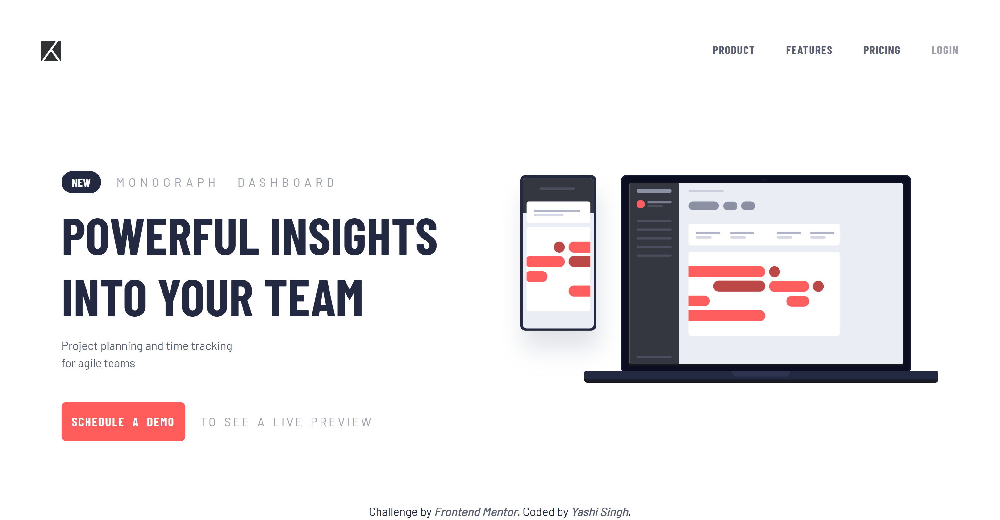
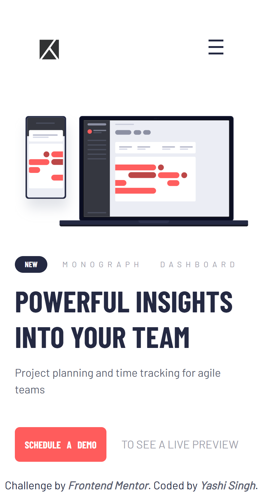

# Frontend Mentor - Project Tracking Intro Component Solution

This is my solution to the [Project Tracking Intro Component challenge on Frontend Mentor](https://www.frontendmentor.io/challenges/project-tracking-intro-component-5d289097500fcb331a67d80e). This challenge helped me enhance my skills in responsive web design, LESS preprocessing, and JavaScript functionality.

## Table of Contents

- [Overview](#overview)
  - [The Challenge](#the-challenge)
  - [Screenshot](#screenshot)
  - [Links](#links)
- [My Process](#my-process)
  - [Built With](#built-with)
  - [What I Learned](#what-i-learned)
  - [Continued Development](#continued-development)
  - [Useful Resources](#useful-resources)
- [Installation and Running LESS](#installation-and-running-less)
- [Author](#author)
- [Acknowledgments](#acknowledgments)

---

## Overview

### The Challenge

Users should be able to:

- View the optimal layout for the site depending on their device's screen size.
- See hover states for all interactive elements on the page.
- Create the background shape using code.
- Toggle the mobile navigation menu.

---

### Screenshot

**Desktop Design**



**Mobile Design**



---

### Links

- **Solution URL:** [Frontend Mentor Solution](https://www.frontendmentor.io/solutions/project-tracking-intro-component-4wSDXSJAgd) 
- **Live Site URL:** [Live Site](https://yashi-singh-9.github.io/Project-Tracking-Intro-Component/)
  
---

## My Process

### Built With

- Semantic HTML5
- CSS (via LESS preprocessing)
- Bootstrap 5 for responsive grid and utilities
- JavaScript (for navigation menu toggle functionality)
- Mobile-first workflow

---

### What I Learned

During this project, I reinforced my understanding of responsive design, JavaScript for interactive components, and preprocessing with LESS.

---

### Continued Development

In future projects, I want to focus on:

- Further improving my JavaScript skills for animations and dynamic content.
- Deepening my understanding of LESS and experimenting with mixins and advanced features.
- Implementing more accessibility-friendly features.

---

### Useful Resources

- [LESS Documentation](https://lesscss.org/) - Helped me understand and implement variables and nesting.
- [Bootstrap 5 Docs](https://getbootstrap.com/) - Used for layout and responsiveness.
- [MDN Web Docs](https://developer.mozilla.org/) - For CSS and JavaScript references.

---

## Installation and Running LESS

To run the project and compile LESS files, follow these steps:

1. **Install Node.js and npm** (if not already installed):  
   [Download Node.js](https://nodejs.org/).

2. **Install LESS globally**:
   ```bash
   npm install -g less
   ```

3. **Compile LESS to CSS**:
   - Navigate to your project folder and run:
     ```bash
     lessc styles.less style.css
     ```

4. **Open the `index.html` file** in your browser to view the project.

---

## Author

- **LinkedIn**: [Yashi Singh](https://www.linkedin.com/in/yashi-singh-b4143a246)
- **Frontend Mentor**: [Yashi-Singh-9](https://www.frontendmentor.io/profile/Yashi-Singh-9) 

---

## Acknowledgments

A big thank you to [Frontend Mentor](https://www.frontendmentor.io/) for this challenge, and to all the amazing resources that made this project possible.
